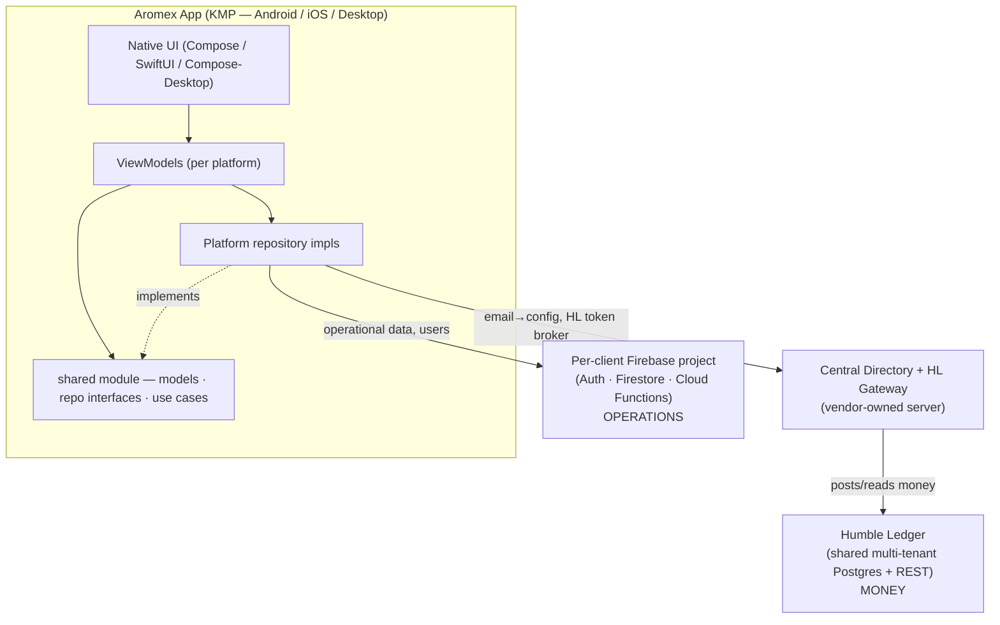
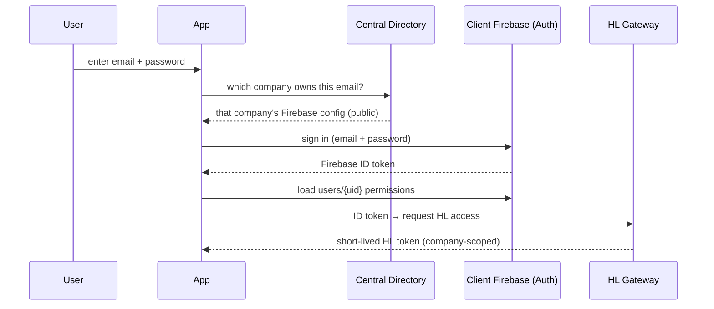

# Aromex (KMP Rebuild) — Product Requirements Document

**Status:** Draft v1 · **Owner:** Ansh Bajaj (PM) · **Last updated:** 2026-06-20
**Companion docs:** [FEATURES.md](FEATURES.md) (functional spec of the existing app), Humble Ledger `HANDOVER.md` / `MOBILE_ADMIN_API.md`

---

## 1. Overview & Vision

Aromex is accounting + operations software for **mobile-phone distributors/retailers**. The current product is a Swift Multiplatform app (iOS/macOS) that works well functionally but has an unscalable, hastily-built Firebase data model and no Android/Windows support.

This PRD covers a **ground-up rebuild in Kotlin Multiplatform (KMP)** targeting **Android, iOS, and Desktop (Windows)**, productized to be **sold to multiple distributor companies**. The rebuild moves all financial bookkeeping onto **Humble Ledger** — an existing, production-grade, multi-tenant double-entry accounting backend — and keeps Aromex focused on operations (inventory, sales/purchase workflows, scanning) and UI.

**North star:** a scalable, multi-tenant, cross-platform product with trustworthy books, sellable to many distributors.

---

## 2. Goals & Non-Goals

### Goals
- Feature parity with the existing app's operational workflows (see [FEATURES.md](FEATURES.md)), rebuilt cleanly.
- Cross-platform: **Android, iOS, Windows/Desktop** from one codebase (native UI + shared logic).
- **Sellable to multiple companies** with strong per-client data isolation.
- **Correct, auditable accounting** via Humble Ledger (immutable double-entry).
- A clean, scalable data model that fixes the original Firebase problems.
- **Retrofittable to a general POS.** Phone-first now, but the data model + naming generalize so phones become one **mode** (alongside general/quantity retail, other serialized goods, services) without a rewrite. See the Decision Log (§14) and `CLAUDE.md` "North star". *(Generalize schema + vocabulary now; implement only the phone mode in v1.)*

### Non-Goals (explicitly out of scope for v1)
- **Multi-currency / FX.** Each company operates in exactly **one** currency, chosen at setup. All of the following are **cut** from the old app: per-transaction currency picker, Add Currency, Exchange Rates, Direct Rate Input, Currency Exchange mode, FX Profit Breakdown, per-entity multi-currency balances.
- **Offline mode.** The app is **online-only** (no local-first sync / conflict resolution).
- **Data migration.** Each company **starts fresh**; no automated import from the old app.
- A consumer/self-serve signup funnel — onboarding is vendor-driven (see §8).

---

## 3. Target Users

| Persona | Description | Typical needs |
|---|---|---|
| **Vendor (you / Humble Solutions)** | Sells & provisions Aromex to client companies | Create companies, manage billing |
| **Company Owner / Admin** | Runs one distributor company's instance | Full access; creates staff & sets their permissions |
| **Staff (Salesperson / Inventory / Accountant)** | Day-to-day operators | Scoped access to only the features the admin grants |

---

## 4. Platforms

- **Android** — Jetpack Compose UI.
- **iOS** — SwiftUI UI.
- **Desktop (Windows, also macOS/Linux)** — Compose for Desktop (JVM) UI.
- Scanner (camera/barcode) is supported on **Android + iOS**; on Desktop, IMEI is entered manually or received from a mobile scan via the scanner hand-off channel.

---

## 5. System Architecture

Two backends, split by responsibility:



### 5.1 Responsibility split

| Concern | Lives in | Notes |
|---|---|---|
| Ledger, balances (Cash/Bank/Credit Card/AR/AP), customers, suppliers, sales, purchases, payments, expenses, refunds, invoices, tax, financial reports | **Humble Ledger** | One HL `company` per client; shared multi-tenant Postgres; REST. Reachable from all platforms incl. Windows with no Firebase SDK. |
| Inventory (phones by IMEI), brands/models/colors/carriers/locations, products, scanning, **users + permissions**, company settings, operational records of each sale/purchase (line items, IMEIs, profit) | **Per-client Firebase** | One Firebase **project per client** (isolation + exact per-client cost). |
| Email→company routing, Firebase config delivery, HL credential brokering, provisioning registry | **Central Directory / Gateway** | Small vendor-owned service. HL credentials never reach client devices. |

### 5.2 KMP architecture (per the team's KMP Architecture Guide)

**3-layer: Native UI + Shared Business Logic. No shared UI, no expect/actual, no DI framework, manual DI.**

```
shared/                 # pure Kotlin — zero platform imports
  model/                # data classes
  repository/           # interfaces ONLY (suspend fns, shared models)
  usecase/              # business logic; depends only on repo interfaces
  util/ config/

androidApp/  (Compose)  # MainActivity, ViewModels (StateFlow), repo impls (Android SDKs), ui/
iosApp/      (SwiftUI)  # ViewModels (@MainActor ObservableObject), repo impls (iOS SDKs), ui/
desktopApp/  (Compose-Desktop / JVM)  # ViewModels, repo impls (JVM: REST + Firestore Admin SDK), ui/
```

- Repository **interfaces** are shared; **implementations** are per-platform (Firestore via native SDK on Android/iOS, via **service-account/Admin SDK** on Desktop JVM; HL via REST on all).
- **Use cases** hold all business logic and validation; they depend only on interfaces.
- ViewModels do **manual DI** (build their own dependency chain), are per-platform, not shared.
- **Caching:** fetch a dataset once on ViewModel init, hold it in memory, and do search/filter/pagination client-side (no re-fetch). Use for bounded datasets; use live reads for write-heavy/real-time surfaces (e.g. balances, scanner channel).

---

## 6. Humble Ledger Integration

HL already provides (verified against its schema & API): immutable double-entry transactions, idempotency by `(companyId, appId, sourceId)`, `Customer` (AR) and `Vendor` (AP) models with an `externalId` for cross-system identity, sales/payments/expenses/refunds endpoints, raw `/transactions` escape hatch, account ledger, receivables, and `pnl` / `balance-sheet` / `trial-balance` reports.

### 6.1 Integration contract
- **`appId` = `aromex`**; **`sourceId` = the Aromex operational record ID** (e.g. the Firestore sale/purchase doc ID). This makes every post **idempotent** — retries never double-book.
- Aromex maps its entities to HL via **`externalId`** (Aromex customer/supplier ID → HL `Customer`/`Vendor`).
- Each company's **chart of accounts** is provisioned in HL at onboarding: `Cash`, `Bank`, **`Credit Card`**, `Accounts Receivable`, `Accounts Payable`, `Sales Revenue`, `GST Payable`/`GST Input`, **`PST Payable`/`PST Input`** (where applicable), and expense accounts.

### 6.2 Required HL extension — configurable tax (GST + PST)
HL today books a **single** tax line (defaults to `GST Payable`). Aromex needs **0, 1, or 2** tax lines per company:
- Canada (separate PST provinces — BC/SK/MB/QC): **GST + PST** (two lines).
- Canada (HST provinces) / GST-only / India: **one line**.
- This is a **contained extension** to HL's high-level sale/expense posting (add a second tax leg + per-company tax config), **or** Aromex posts via raw `/transactions` with both tax legs. → **Decision pending (see §13).**

### 6.3 Aromex ↔ HL sync reliability (critical)
Each financial workflow is a **dual write**: an operational record in Firebase **and** a posted transaction in HL. These must not drift (HL's own history shows a real `AR_BALANCE_DRIFT` from a missed post).
- **Pattern:** write the Firebase operational record first with `hlSyncStatus = pending` → post to HL (idempotent by `sourceId`) → mark `synced`. On failure, a durable retry re-posts (safe, idempotent).
- A periodic/admin **reconciliation** check flags any operational record without a matching HL transaction.

### 6.4 Open accounting-model question — inventory valuation / COGS
Profit-per-phone = sale price − inventory unit cost (Aromex data). Whether inventory is carried as an **asset in HL with COGS on sale** (proper books) or **expensed at purchase** with profit computed operationally affects how purchases/sales post. → **Decision pending (see §13).**

---

## 7. Authentication & Authorization

### 7.1 Login — email-based workspace discovery (no company code)
Industry-standard "home realm discovery" (à la Slack/Google Workspace).



- **No company code.** The email self-routes to the right company's Firebase.
- **Multi-company fallback:** if one email maps to >1 company (rare — e.g. a shared accountant), show a **"choose your company"** screen.
- **Directory hygiene:** the email-lookup endpoint is **rate-limited** and returns only the technical config (not the company name) to avoid customer/email enumeration.
- **HL credentials never reach the device** — the gateway brokers a short-lived, company-scoped HL token after verifying the Firebase ID token.

### 7.2 Users & permissions (capability-based)
- **Owner/Admin** (full access incl. user management) + **staff** with **per-feature scopes**.
- The admin sets each staff member's scopes **at creation time**; scopes are `manage` / `view` / `none` per feature.
- **User creation runs through a Cloud Function** (Firebase Admin SDK) so the admin isn't logged out; it also writes the new user's **email→company mapping** into the Central Directory.
- Permissions are the **single source of truth in `users/{uid}`**, enforced in **shared app logic** (because Desktop's Admin-SDK access bypasses Firestore rules); Firebase Security Rules are a backstop on mobile, and **custom claims** (`{ admin, hlCompanyId }`) handle cheap rule checks.

#### Permission catalog (proposed — confirm in §13)
`sales` · `purchases` · `inventory` · `transactions` · `profiles` · `balances` · `reports` · `statistics` · `histories` · `ledgers` · `settings` · `userMgmt` — each `manage`/`view`/`none` (`userMgmt` is admin-only boolean).

### 7.3 Firebase auth schema (per-client project)
```
users/{firebaseUid}
  email, displayName, role: "admin"|"member"
  permissions: { sales, purchases, inventory, transactions, profiles,
                 balances, reports, statistics, histories, ledgers,
                 settings: "manage"|"view"|"none", userMgmt: bool }
  isActive, createdBy, createdAt, updatedAt, lastLoginAt

companySettings/profile        (singleton)
  companyName, legalName, logoUrl, country, currency
  tax: { gstEnabled, gstRate, pstEnabled, pstRate, isHST }
  hlCompanyId
  businessAddress, contactEmail, contactPhone
  timezone                       // IANA zone (e.g. "America/Vancouver"); invoice date formatted in it (#80)

invites/{inviteId}             (optional)  email, permissions, invitedBy, status, expiresAt
```

### 7.4 Central Directory schema (vendor-owned)
```
companies/{companyId}
  displayName, status: "active"|"suspended"
  firebaseConfig: { apiKey, authDomain, projectId, appId, ... }   // public, pre-auth
  secrets (server-only): { serviceAccountKeyRef, hlCompanyId, hlCredentialRef }
  currency, branding, createdAt
emailIndex/{emailHash} → [companyId, ...]                          // home-realm discovery
```

---

## 8. Multi-Tenancy, Onboarding & Billing

- **Isolation:** **one Firebase project per client** (strong isolation + clean per-client cost). HL is shared but multi-tenant by `companyId`.
- **Billing model:** the **vendor owns and pays** every client's Firebase project, then **invoices each client monthly = exact Firebase cost (per-project, from Google billing) + the vendor's software fee.** (A vendor console to automate cost pull is future work.)
- **Provisioning:** **manual, by checklist** for now (automated vendor console later).

### 8.1 Provisioning runbook (per new client)
1. Create the client's **Firebase project**; link it to the vendor billing account; enable Auth + Firestore + Functions.
2. **Register the company in Humble Ledger**; set its **currency**; provision the **chart of accounts** (incl. `Credit Card`, and `PST Payable`/`PST Input` where applicable).
3. Write the **Central Directory** entry (Firebase config + secrets + currency + tax config + branding).
   - Set `companySettings/profile.timezone` to the shop's **IANA zone** (e.g. `America/Vancouver`) so invoice dates print in local time (#80); if omitted, dates fall back to UTC.
4. Create the **Owner/Admin** in the client's Firebase Auth (Cloud Function) + `users/{uid}` with full permissions; add their email to the directory's `emailIndex`.
5. Email the Owner their **credentials**. They log in and onboard their own staff.

---

## 9. Feature Specification (by module)

> Detailed UX behavior is in [FEATURES.md](FEATURES.md). Below summarizes each module's scope and its HL/Firebase/permission touchpoints. **All currency/FX sub-features are removed** (see §2).

### 9.1 Home / Dashboard
- Account balances (**Cash, Bank, Credit Card**) + quick actions.
- **Source:** HL (`balance-sheet`/account ledger). Balance edits post an **adjustment journal** to HL (not a raw overwrite). Permission: `balances`.

### 9.2 Transactions (manual money movement)
- Record a payment/transfer between parties/accounts (From/To, amount, notes, date). **Currency picker removed** — always the company currency.
- **Source:** posts to HL (`PAYMENT`/`JOURNAL`); parties resolve to HL customer/vendor/`Cash`/`Bank`. Permission: `transactions`.

### 9.3 Purchase
- Supplier selection, products (phones by **IMEI**, specs, unit cost), services, expenses, **GST/PST**, adjustment, payment (Cash/Bank; Credit Card N/A), remaining/credit, invoice PDF.
- **Firebase:** operational purchase record (line items, IMEIs) + new phones into inventory. **HL:** posts the purchase (vendor/AP, payment, tax) idempotently by the Firebase record ID. Permission: `purchases`, `inventory` (to add stock).

### 9.4 Sales (all platforms incl. iPhone)
- Customer selection, pick phones from inventory **by IMEI** (filtered by location), per-phone **selling price + profit**, services, **GST/PST**, adjustment, payment, **middleman** flow, invoice PDF.
- **Firebase:** operational sale record + inventory state change. **HL:** posts sale (AR, revenue, tax) + payment idempotently. Permission: `sales`.
- *(Correction vs old app: Sales is available on **all** platforms, including iPhone.)*

### 9.5 Profiles / Entities
- **Customers, Suppliers, Middlemen.** List, search, add/edit/delete, per-entity detail with balance + transaction history + **Print Ledger**.
- **HL:** `Customer` (AR) / `Vendor` (AP); **Middleman** modeled as a customer/vendor/generic account (**decision pending §13**). Balances & history from HL. Profile fields (contact/notes) may live in Firebase. Permission: `profiles`.

### 9.6 Inventory (IMEI-level)
- Brand → Model → Phone hierarchy; per-phone attributes (IMEI, capacity, color, carrier, status, location, unit cost); search/filter/sort; add/edit/delete; scan-to-add.
- **Firebase only** (operational). Permission: `inventory`.
- **POS-retrofit guardrail:** model this as a generic `Product` / `InventoryItem` with `trackingMode = SERIALIZED` carrying the phone attribute profile (brand/model/capacity/carrier/IMEI). The Brand→Model→Phone hierarchy is the **phone-mode presentation** over that generic model, **not** a hardcoded top-level "Phone" schema — so `QUANTITY`/`VARIANT`/`SERVICE` modes drop in later without a rewrite. See `CLAUDE.md` "North star".

### 9.7 Scanner (Android + iOS)
- Camera barcode/IMEI scan; hand-off channel so a scan flows into Add/Edit Product and the Sales cart. Desktop = manual entry or receive a mobile scan.
- **Firebase** scanner channel. Permission: tied to `inventory`/`sales`.

### 9.8 Histories & Ledger
- Transaction history (filter by type/date, search) and **PDF ledger/statement** per entity or category, for a date range.
- **HL:** transactions/ledger reads. **Aromex:** renders the PDF cross-platform. Permission: `histories`, `ledgers`.

### 9.9 Balance Report
- Company-wide receivables/payables + account balances + **inventory value**.
- **HL:** `/customers`, `/vendors`, `balance-sheet`. **Firebase:** inventory value (sum of unit costs). Permission: `reports`.

### 9.10 Statistics (biometric-locked)
- Financial stats (sales/purchases/profit/expenses/tax/payment-mix) from **HL reports**; operational stats (phones sold/purchased, top models, profit-per-phone) from **Firebase**.
- Biometric gate on mobile. Permission: `statistics`.

### 9.11 User Management (admin)
- Create/disable staff, set per-feature scopes, reset access. **Cloud Function** + `users/{uid}`. Permission: `userMgmt` (admin).

### 9.12 Settings
- Company profile, business name/logo, **tax configuration (GST/PST rates)**, currency (read-only after setup). Permission: `settings`.

---

## 10. Documents (Invoices & Ledgers)
- PDF generation must work on **Android, iOS, and Desktop**. Invoices and ledgers are paginated, with editable/persistable company header, shared via each platform's native mechanism.
- Financial figures come from HL; line-item detail (IMEIs, per-phone) from the Firebase operational record.

---

## 11. Non-Functional Requirements
- **Money correctness:** never use floating point for money in shared/UI code; treat HL money as decimal strings; HL enforces double-entry + decimal precision.
- **Security:** HL credentials never on device; service-account keys (Desktop) fetched post-auth, stored in OS secure storage, rotatable; permissions enforced in app logic; rate-limited directory lookups.
- **Availability:** online-only; clear "no connection" states.
- **Scalability:** per-client Firebase isolation; HL multi-tenant; bounded-dataset caching client-side.
- **Scale targets:** _TBD — confirm (clients, users/client, transactions/day, inventory size) to size HL infra (currently a 1 vCPU / 1 GB droplet — will need upsizing for production multi-client load)._

---

## 12. Milestones (for GitHub Projects)

| # | Milestone | Scope |
|---|---|---|
| **M0** | Foundations | KMP project skeleton (shared/android/ios/desktop), CI, coding standards, repo structure |
| **M1** | **Auth & Onboarding** | Email-discovery login, Firebase Auth, Central Directory + HL gateway, permissions, user management, provisioning runbook ← **next: tickets** |
| **M2** | HL integration + tax extension | HL client, sync/idempotency layer, GST/PST extension, chart-of-accounts provisioning |
| **M3** | Profiles / Entities | Customers, Suppliers, Middlemen (HL + Firebase) |
| **M4** | Inventory + Scanner | IMEI inventory, scan-to-add |
| **M5** | Purchase + invoice PDF | Purchase flow, dual-write, invoice generation |
| **M6** | Sales + invoice PDF | Sales flow, profit, middleman |
| **M7** | Home + Transactions | Balances dashboard, manual transactions |
| **M8** | Histories + Ledger PDF | History views, ledger/statement generation |
| **M9** | Balance Report | Receivables/payables + inventory value |
| **M10** | Statistics | Financial + operational analytics, biometric lock |
| **M11** | Settings, hardening, vendor console | Settings, reconciliation, billing automation |

---

## 13. Open Decisions (to resolve as we ticket)
1. **Permission catalog** — confirm the feature list & `manage/view/none` granularity (§7.2).
2. **Scale targets** — numbers to size HL infra (§11).
3. **Tax extension shape** — extend HL high-level endpoints vs post raw `/transactions` for GST+PST (§6.2).
4. **Inventory valuation / COGS** — asset-in-HL-with-COGS vs expense-at-purchase (§6.4).
5. **Middleman modeling** — customer / vendor / generic HL account (§9.5).

---

## 14. Decision Log (locked)
- Money → **Humble Ledger** (shared, multi-tenant); Operations → **per-client Firebase project**.
- **Single currency per company**; all multi-currency/FX features **dropped**.
- **GST + PST configurable** tax (HL extension).
- Ledger = **immutable double-entry**; edit/delete = reverse-and-repost; ledger views show net/current state, history opt-in.
- Reporting = **HL server-side reports/aggregates**.
- **Online-only**; **start fresh** (no migration).
- Multi-tenancy: HL `companyId` + **separate Firebase project per client**.
- Billing: **vendor pays Firebase, passes through exact cost + software fee** monthly.
- Auth: **email-based discovery** (no company code) + multi-company chooser fallback; HL access via **vendor gateway**; **manual provisioning** by checklist.
- KMP: **native UI + shared Kotlin logic**, manual DI, no expect/actual, no shared UI.
- **Phone-first, built retrofittable to a general POS:** generic `Product` / `trackingMode` (`SERIALIZED | QUANTITY | VARIANT | SERVICE`) model + generic naming (`products`/`inventory`/`sales`/`serials`, not `phones`); implement only the phone (`SERIALIZED`) mode in v1. Generalize schema + vocabulary; don't over-generalize behavior/UI. See `CLAUDE.md` "North star".
